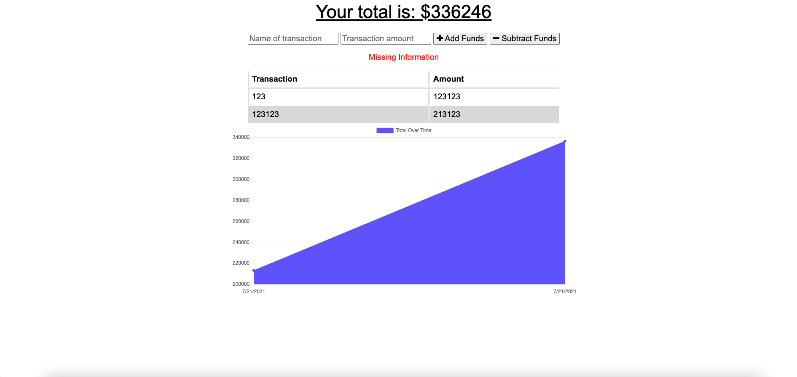

# Budget Tracker
## Description
Allows the user to track their budget with or without an internet connection.  
## Table of Contents
- [Description](#description)
- [Installation](#installation)
- [Usage](#usage)
- [Contributors](#contributors)
- [Tests](#tests)
- [License](#license)
- [Contact](#contact)  
## Installation
No install needed visit live demo below  
https://budgettracker-v123.herokuapp.com/  
## Usage
Add/Subtract the funds to your budget.  
## License
No license was needed for this application.   
## Contributors
Anthony2428  
## Tests

## Contact 
Email: alopez0218.al@gmail.com  
GitHub: [Anthony2428](https://github.com/Anthony2428) 
 
This README was generated by [https://github.com/Anthony2428/READMe-Generator]